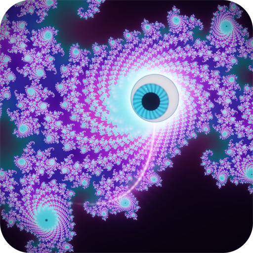

# TapFractal



> ⚠️ **Photosensitivity warning.** This app displays flashing lights and rapidly moving
> high-contrast patterns generated in real time, which may trigger seizures in people with
> photosensitive epilepsy, even with no prior history of seizures. Stop and consult a
> physician if you experience dizziness, altered vision, twitching or disorientation. A
> notice is shown on first launch and must be acknowledged; **Echo trails** and **Stereo**
> can be turned off in Settings to reduce intensity. See [LICENSE](LICENSE) for the full notice.

A head-swung glowing eyeball in a live GPU fractal, for the RayNeo X3 Pro glasses.

The **sluurp** is a psychedelic eyeball on an elastic rope: you swing it at glowing targets and
the world grows deeper on every hit. There are no hand controllers — the tether is your **head**,
the room is a raymarched fractal that flows toward you wherever you look, and the music drives
the picture.

Kotlin + OpenGL ES 3, zero dependencies, zero permissions, no network. Package `com.tapfractal`.

## What you do

- A glowing eyeball (the **sluurp**) hangs on an elastic rope from an anchor about 1.4 m ahead of
  your head. Turn your head and it swings like a yo-yo; **tap** the temple pad to flick it.
- Glowing **fractal eyes** appear ahead of you in open space. Touching one with the sluurp is a HIT:
  burst, chime, the world grows one depth level (the structure steps, the palette steps, the rope
  lengthens) and a new eye spawns ahead. Eyes you fly past are quietly recycled. Nothing ever says
  "game over".
- **Gaze navigation**: you fly forward along wherever you look. Turn your head and the flight banks;
  the fractal's own distance field keeps you from clipping through it (the flight hovers and slides
  along a surface, the sluurp bounces off it). Swipe up/down to change the speed level; HOVER stops you
  so you can look around.

## The four rooms

| # | Room | Fractal | The sluurp is… | Music |
|---|---|---|---|---|
| 1 | **The Tidepool** | 2D Phoenix–Julia plane with orbit traps, kaleidoscope fold at depth 3+; gaze pans and dives across the plane | an orbit trap dragging a filament through the set; its swing bends the Julia constant | dreamy downtempo (70 BPM) |
| 2 | **The Nave** | raymarched Mandelbulb cathedral, power breathes with the music | a lantern brushing stained-glass ribs; hits ring the bulb | hypnotic progressive (117 BPM) |
| 3 | **The Throat** | kaleidoscopic-IFS Menger lattice, infinite tunnel; fold count = depth | a comet you tow; flicks leave echo streaks | drumstep / drum & bass (174 BPM) |
| 4 | **The Hive** | raymarched Apollonian sphere packing, pitch dark | the only lamp; bass extends its reach; every hit is a flashbulb | progressive psytrance (135 BPM) |

Swipe forward/back on the temple pad to move between rooms (1 s crossfade of picture and music).
Best depth per room and total sluurps are kept.

## Controls (right temple pad)

| Gesture | In play | In the settings menu |
|---|---|---|
| Tap | flick the sluurp (a tap while it is in free flight recalls it) | toggle / adjust / activate the selected row |
| Double-tap | open the settings menu | close the menu (or leave About) |
| Triple-tap | re-centre the head (yaw drift correction) | — |
| Swipe forward / back | next / previous room | adjust the selected value |
| Swipe up / down | speed level +1 / −1 (HOVER · SLOW · CRUISE · FAST · WARP) | move the selection |

One swipe is one step, always. There is no long-press (the glasses reserve it for the system
quick-settings shade). The left temple pad is the system volume pad and is ignored.

## Settings (double-tap)

Scene · Music (On/Off) · Volume · Stereo (Off / Subtle / Deep) · Echo trails (Off / Soft / Wild) ·
Quality (Auto / Low / High) · Head tracking (On/Off — Off flies an automatic path) · Show HUD (On/Off) ·
About (credits, music attribution, the photosensitivity note) · Reset Settings (confirm twice).
Everything persists; Reset Settings keeps your stats and the acknowledged notice.

Quality Auto runs 60 fps while the picture is cheap and drops to a vsync-locked 30 fps with a higher
internal resolution when it is not; the internal render resolution adapts to the measured GPU time.

## Photosensitivity and stereo parallax

**TapFractal contains flashing lights and moving patterns.** A notice is shown on first launch and
must be acknowledged with a tap; stop and rest if you feel dizzy or unwell. Beat-driven pulses are
gated to at most three per second and there are never full-field flashes; **Echo trails** and
**Stereo** can both be turned off in Settings.

The glasses show a side-by-side picture. With **Stereo parallax** on (Subtle by default), each eye
is rendered from a slightly different point, converged at the sluurp's anchor distance, so the toy
and the fractal have depth; **Deep** widens the offset and follows the sluurp; **Off** renders one
picture for both eyes and is easiest on the eyes. The HUD is always drawn at zero disparity.

## Music

All four tracks are Creative Commons Attribution works, bundled unchanged except where a bitrate
re-encode is stated in `app/src/main/assets/music/ATTRIBUTION.md` (slots 1 and 3 were re-encoded to
160 / 256 kbps to fit the asset budget). They are credited here, in the app's About page and in that
file. Licences: [CC BY 4.0](http://creativecommons.org/licenses/by/4.0/) ·
[CC BY 3.0](http://creativecommons.org/licenses/by/3.0/).

- **The Tidepool** — "Dream Catcher" Kevin MacLeod (incompetech.com)
  Licensed under Creative Commons: By Attribution 4.0 License
  http://creativecommons.org/licenses/by/4.0/
  — https://incompetech.com/music/royalty-free/index.html?isrc=USUAN1800019
- **The Nave** — "Ethernight Club" Kevin MacLeod (incompetech.com)
  Licensed under Creative Commons: By Attribution 4.0 License
  http://creativecommons.org/licenses/by/4.0/
  — https://incompetech.com/music/royalty-free/index.html?isrc=USUAN2100002
- **The Throat** — "Warriors Fall (Original RumbleStep Mix)" by cdk
  (c) copyright 2015 Licensed under a Creative Commons Attribution (3.0) license.
  http://ccmixter.org/files/cdk/50691
  Ft: Darryl J
- **The Hive** — "The Beach" by Platinum Butterfly (F_Fact)
  (c) copyright 2012 Licensed under a Creative Commons Attribution (3.0) license.
  http://ccmixter.org/files/F_Fact/37699
  Ft: debbizo
  Uses samples from: "Beach (Moana)" by debbizo (c) copyright 2010
  Licensed under a Creative Commons Attribution (3.0) license.
  http://ccmixter.org/files/debbizo/26843

The sound effects are synthesised at runtime (no audio assets besides the four tracks). The music
envelopes that drive the picture (`sceneN.env.json`) are produced offline by `tools/analyze_music.py`;
see `docs/MUSIC.md`.

## Build and install

Requires JDK 17, the Android command-line tools (`sdk.dir` in `local.properties`) and the bundled
Gradle wrapper (Gradle 8.9 / AGP 8.7.3 / Kotlin 2.0.21; compileSdk 35, minSdk 29).

```sh
cd TapFractal
JAVA_HOME=$(/usr/libexec/java_home -v 17) ./gradlew assembleDebug
adb install -r app/build/outputs/apk/debug/app-debug.apk
adb shell am start -n com.tapfractal/.MainActivity
```

The app declares itself to the RayNeo launcher (`com.rayneo.mercury.app`, category
`com.rayneo.intent.category.AR_APP`) and renders a 1280×480 side-by-side surface. Screenshots:
`adb exec-out screencap -p > shot.png` (the left eye is the left 640 px). A log line with frame
time / rung / fps is printed every 5 s under the tag `TapFractal`. Debug flags:
`adb shell settings put global tapfractal_debug "rung=5,noecho"` (see `docs/CORE_API.md` §6).

## Documentation

- `docs/SPEC.md` — the baseline spec and the hardware ground truth
- `docs/DESIGN.md` — the unified design (toy physics, rooms, rendering pipeline, HUD, menu)
- `docs/CORE_API.md` — the contract between the core and the four scene files, with measured on-device numbers
- `docs/SHADER_CONTRACT.md` — the uniforms and helpers every scene shader gets
- `docs/MUSIC.md` — track choice, licence chain and the envelope analyser

The app icon (`art/icon-512.png` and the launcher mipmaps) is rendered by `tools/make_icon.py`:
a Julia-set spiral in hot magenta, cyan and violet with the sluurp and a faint rope arc.

## License

MIT — see [LICENSE](LICENSE), which also carries the full photosensitivity notice and the
music licensing terms (the four bundled tracks are CC BY, not MIT — see the Music section above).

tropicalstream · no network, no permissions.
